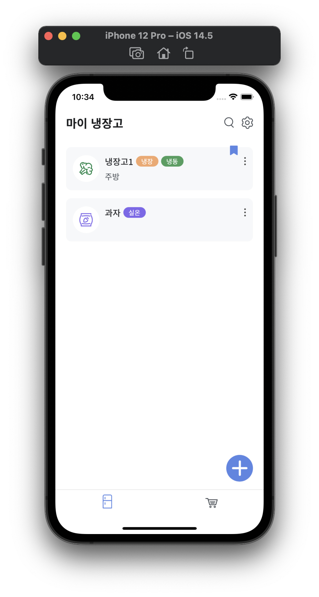
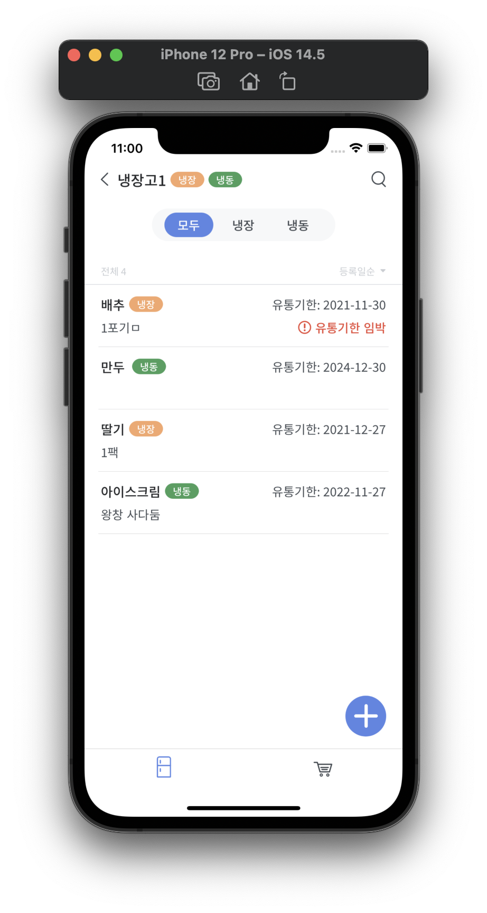
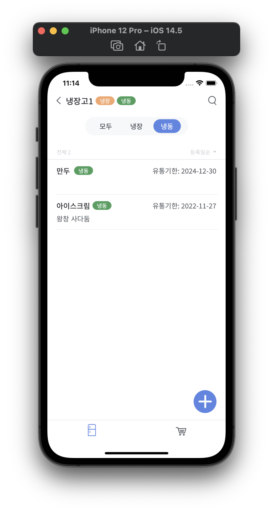
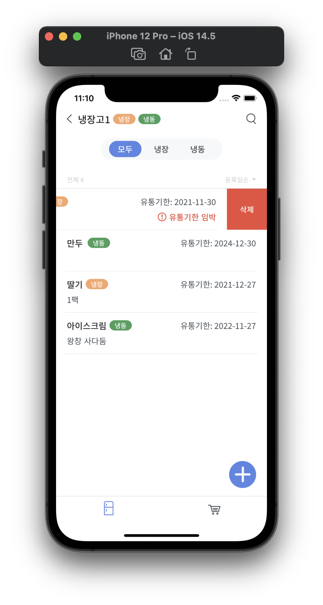
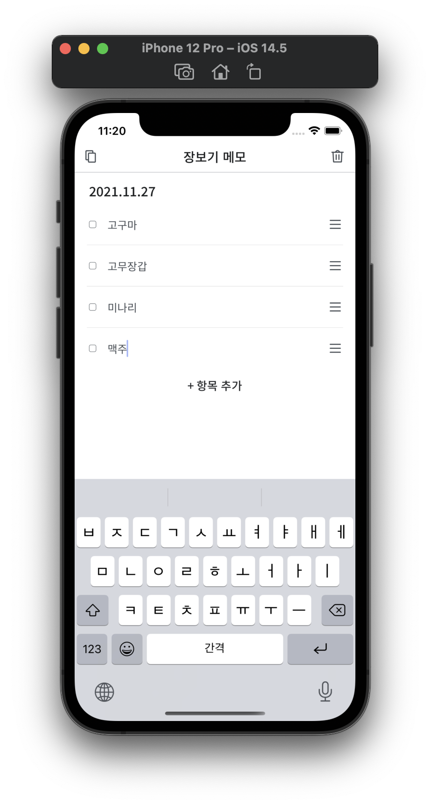
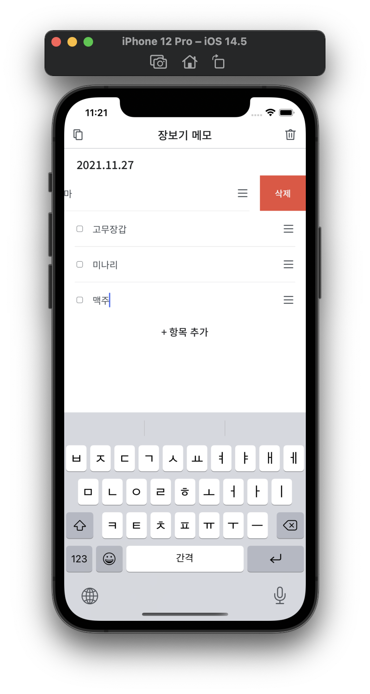
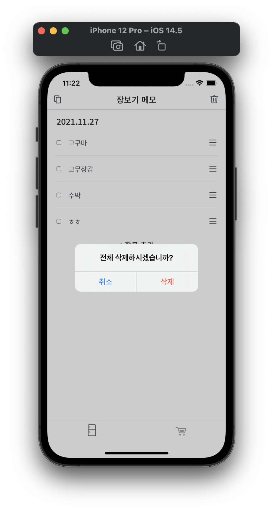

# my 냉장고 (iOS)

## 1. 목적

-  냉장고 관리가 힘든 자취인들을 위한 관리 도우미 어플리케이션
-  냉장고 안의 음식을 기록하여 사용자가 유통기한을 관리할 수 있게 함.

 

## 2. 개발 환경 

-  iOS (Swift)
    - SnapKit

- 서버
    - Spring Boot (Java)

 

## 3. 프로젝트 구조와 개발 일정

### 3.1 프로젝트 구조

와이어프레임, 데이터 흐름 설계도

 

### 3.2 개발 일정

21.01.07 - 21.01.13: 기획  
21.01.14 - 21.02.10: 와이어프레임 작성, 프로토타입 디자인  
21.02.11 - 21.03.10 : 메인 탭바, 장보기 메모 기능 구현  
21.03.11 - 21.03.30 : 냉장고 기록 기능 UI 구현  
21.03.31 - 21.05.30 : 냉장고 기록 기능 로직 개발  
21.06.01 - 21.06.30 : 디자인 맞춤  

알림 기능, 설정 구현, 전체 기능 디버깅, 백엔드 연결 예정

 

## 4. 역할 분담

기획, iOS 개발을 맡아서 담당하였습니다.

 

## 5. UI / 기능

### 5.1  냉장고 관리 기능

- 냉장고와 냉장고 안에 있는 음식을 기록할 수 있는 기능.

 

#### 5.1.1 냉장고 목록 화면

    
    
    

- 냉장고 추가, 편집, 삭제 
    - \+ 버튼을 눌러 냉장고 추가 가능 - 아이콘 (4종류 제공) 냉장고 이름, 종류, 기본 냉장고 여부, 메모를 입력할 수 있다.
    - 냉장고 옆의 더보기 버튼을 눌러 냉장고 편집, 삭제 가능
    - 냉장고 : 식품 목록으로 이동
- 검색, 설정
    - 검색 : 모든 냉장고 내 음식 검색
    - 설정 : 알림과 관련된 설정

 

#### 5.1.2 식품 목록 화면

- 냉장고 상세 식품 목록 화면
- 식품 추가, 편집, 삭제
    - \+ 버튼을 눌러 식품을 추가할 수 있고
- 등록일순, 유통기한순 정렬 제공

- 필터, 정렬, 검색
    - 필터 : 냉장고 종류가 냉장/냉동인 경우 냉장, 냉동 필터 기능
    - 정렬 : 등록일순, 유통기한순 정렬
    - 검색 : 해당 냉장고 내 음식 검색

 

### 2 장보기 메모 기능

- 장 볼 거리를 간단하게 한 줄 씩 메모를 할 수 있는 기능.
- 메모 추가, 수정, 삭제, 이동
    - 꾹 눌러서 메모를 이동 가능.
- 복사, 전체 삭제
    - 왼쪽 상단 버튼을 눌러서 전체 메모를 클립보드에 복사
    - 오른쪽 상단 버튼을 눌러서 전체 메모 삭제 가능.

 

## 6. 느낀점

- AutoLayout이 간단하다고 생각했는데, 여러가지 UI를 구현해보면서 때로는 화면 요소를 맘대로 배치하는 것 자체가 어려운 것을 깨달았다. 

- 디자인에는 키보드가 올라온 경우가 고려가 안되어 있었는데, 키보드가 올라왔을 때 어떻게 동작하는지도 기획 과정에서 신경써야한다는 것을 느꼈다.

- iOS 개발을 혼자 담당하게 되어서 팀원들과 소통할 일이 많이 없을 줄 알았는데, 구현하다보니 정확하게 맞추기 힘들거나 ~~할 순 있는데 귀찮거나~~ 해서 디자인 수정 의뢰도 많이 하고, 백엔드와 처음부터 API 명세서를 써놓고 했으면 더 좋았겠다 라는 생각을 하게 되었다.

- 업무에서 중요한 작업 중 하나가 프로젝트 소요 시간 산정이라고 했는데, 처음 예상과 너무 달랐다. 화면 구현 오류들도 어려웠지만, 사용되는 구조체와 로직을 처음부터 정리하고 시작하는 것과 하면서 잡는 것이 천지차이였다.

- json 형태의 저장이라 그냥 대충 저장하면 되는거 아닐까? 하고 생각했는데, 저장에도 로직이 필요하다는 것을 알게 되었다. VC마다 전체 데이터를 넘겨줘야하는 과정이 반복되었다. 그 과정에서 어떤 화면에서는 바뀐 데이터가 적용이 되었는데 어떤 화면은 바뀐 데이터가 적용이 안되는 경우가 있어서, protocol을 이용해서 하나의 VC만이 데이터를 다른 VC들에게 주고, 저장할 때는 해당 VC가 받아서 저장할 수 있게 만들었다. 이 과정에서 간단한 구조의 데이터만 저장하는게 아닌 경우에는 백엔드가 필요하다는 것도 알게 되었다.

